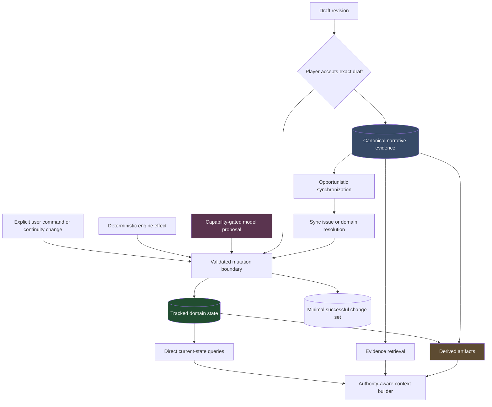
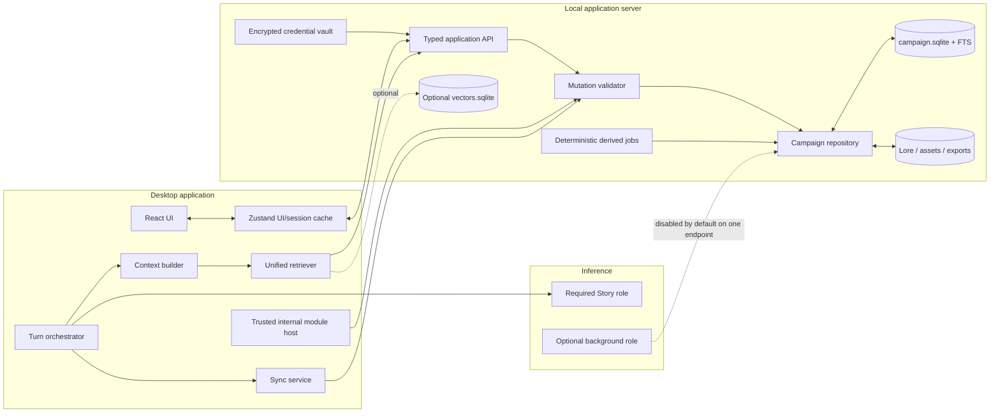
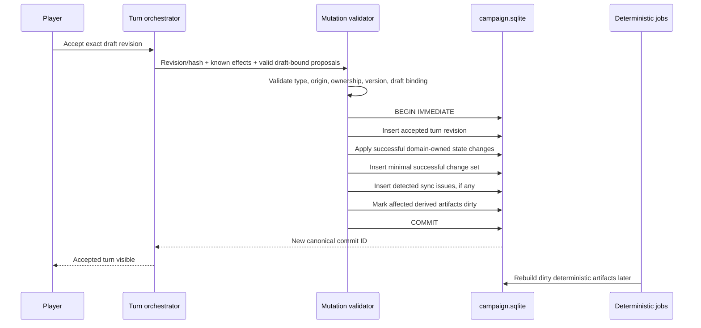
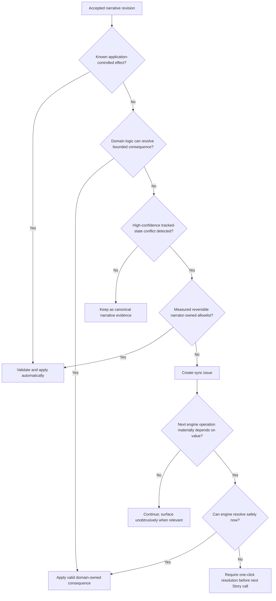
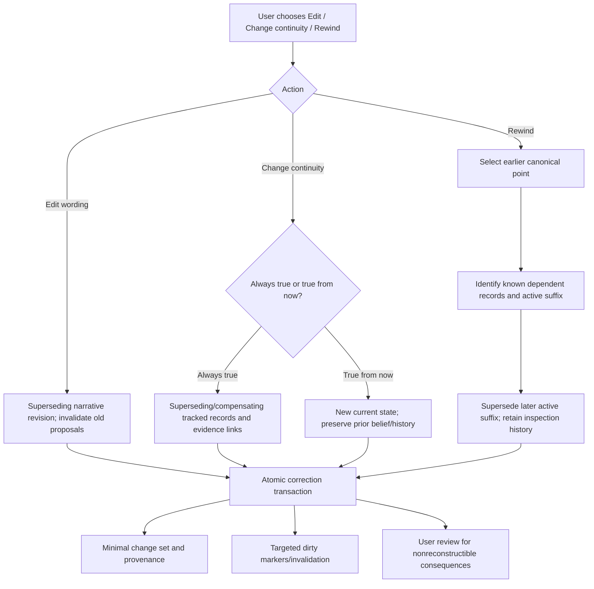
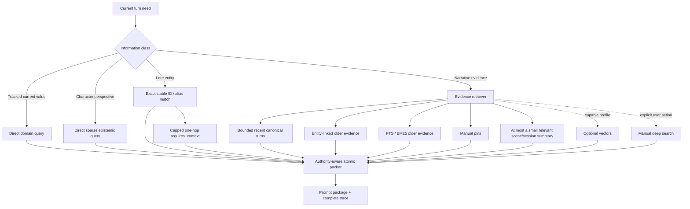

# DMNarrativeEngine-Next Target Architecture

**Status:** Canonical architecture baseline; suitable for roadmap planning  
**Scope:** One human player/controller with one AI narrator/engine  
**Code foundation:** NarrativeEngine-P, simplified and repaired rather than adopted unchanged  
**Supersedes:** Earlier target proposals where they conflict with this document

## 1. Purpose and Architectural Principles

DMNarrativeEngine-Next is a local-first application for long-running, continuity-sensitive narrative play. It must produce good prose while preserving campaign evidence, protecting player agency, maintaining the bounded state needed by mechanics and application behavior, and giving a constrained local model the smallest sufficient context for the next turn.

The architecture follows these principles:

1. **Fiction is broader than structured state.** Structured state covers bounded domains the application must reason about mechanically. Accepted narrative carries the rest of the fiction.
2. **Acceptance is the canon boundary.** Drafts, swipes, suggestions, and model proposals are noncanonical until the player accepts a specific draft.
3. **One write boundary owns tracked state.** Explicit user commands, deterministic engine effects, and model proposals all pass through the same typed validation boundary.
4. **The normal turn requires one model call.** Context assembly is deterministic; Story is the one required streaming request; no blocking model call follows it.
5. **Current tracked state is queried directly.** Retrieval supplies evidence and reference material, never current authority.
6. **Evidence is lossless; interpretations are rebuildable.** Summaries, tags, FTS, vectors, and extracted candidates can be discarded and regenerated.
7. **Player agency has a hard structured boundary and a softer prose boundary.** The application can reject unauthorized PC state mutations; prose compliance also relies on generation instructions and user controls.
8. **Uncertainty is represented honestly.** The system does not claim exhaustive state extraction, fully reconciled turns, perfect epistemic isolation, or complete causal replay.
9. **Local constraints are acceptance constraints.** Weak JSON, absent tools, cold embeddings, CPU inference, and a serialized endpoint are baseline conditions, not exceptional fallbacks.
10. **First-party behavior remains modular without becoming a public executable-plugin platform.** Trusted application code may be internally registered; untrusted runtime code may not control prompts, providers, storage, or UI.

The target intentionally replaces overlapping truth stores, mandatory extraction passes, recursive summary dependence, and overlapping retrieval middleware with a transactional campaign core, bounded tracked domains, one evidence retriever, and one required Story call.

### 1.1 Explicit product scope

“Cooperative play” in this architecture means one human player/controller plus one AI narrator/engine. Multiple human identities, private human-to-human secrets, concurrent edits, per-human OOC permissions, and real-time multiplayer are not part of the current architecture.

## 2. Information-Authority Taxonomy

The campaign contains three primary information classes and one supporting perspective layer.

### 2.1 Tracked machine-actionable state

Tracked state is structured and authoritative only in domains where continuity, mechanics, deterministic logic, validation, or application behavior requires an explicit current value. It is typed and domain-owned.

Examples include identity, ownership, location, presence, scene participation, health, conditions, consequential inventory, deterministic goals and pressures, clocks, first-party module state, continuity-relevant epistemic claims, and explicit campaign assertions promoted by the user or application.

### 2.2 Canonical narrative evidence

An accepted player/narrator exchange is canonical narrative evidence. It preserves what was established in play even if no structured state record exists. “The rain continued through the night” can be canonical fiction without creating a weather row.

> Structured state is authoritative for tracked domains. Accepted narrative evidence remains canonical for the broader fiction.

> Accepted narrative establishes canonical fiction even when no structured tracked-state record exists.

The absence of a structured record does not make accepted fictional content noncanonical. Conversely, prose cannot silently replace an existing tracked value in a domain where the application depends on that value; synchronization or an explicit continuity change resolves such conflicts.

### 2.3 Derived interpretations

Summaries, resume capsules, extracted candidates, retrieval annotations, inferred tags, importance scores, FTS indexes, embeddings, and model suggestions are nonauthoritative and rebuildable. They can locate or characterize source material but cannot establish tracked state or override accepted evidence.

### 2.4 Sparse epistemic state

Epistemic state is tracked perspective, not a second world truth. It records only continuity-relevant claims a character accepts, rejects, or remains uncertain about, along with source evidence and lifecycle metadata. Witness and communication records are provenance; neither automatically proves belief adoption.

### 2.5 Authority flow



Arrows into the mutation boundary are requests, not authority grants. Origin, ownership, expected version, domain rules, and proposal/draft binding determine whether a change is accepted.

## 3. System Invariants

### 3.1 Authority and canonicalization

- Tracked domain state is authoritative inside its declared domain, not an exhaustive model of all fiction.
- Accepted narrative evidence is canonical for broader fiction and remains immutable or explicitly revisioned.
- All tracked-state writes pass through one validated mutation boundary.
- A selected turn revision and its successful tracked changes become visible atomically.
- Derived data cannot become authoritative through retrieval, repetition, or model confidence.
- A correction or current tracked value outranks contradictory older evidence within that tracked domain.
- No turn is declared fully reconciled. A sync issue exists only when a candidate or conflict is actually detected.

### 3.2 Player control

Voluntary PC goals, beliefs, opinions, intentions, speech, choices, and actions require player provenance before they can become tracked authoritative state. A Story-origin proposal alone cannot establish them.

The narrator may describe sensory input, involuntary physical effects, validated external consequences, reflexes where appropriate, coercive or rule-driven effects, and continuation or completion of an action the player explicitly initiated. Prose-level protection is addressed separately in Section 10.

### 3.3 Availability and explainability

- Core play remains available without embeddings, summaries, background model work, image generation, speech, or vision.
- Every context item can be traced to its source, authority/trust class, inclusion reason, token cost, and visibility decision.
- A slow or unavailable auxiliary service cannot prevent campaign opening or the next normal Story turn.

## 4. Trust and Prompt Authority

Prompt trust is independent of fictional authority.

| Trust class | Active instructional authority | Fictional authority | Treatment |
|---|---:|---:|---|
| Trusted application/story instruction | Yes | No by itself | Stable Story, safety, agency, and output contracts |
| Current user action | Yes, for present player intent | Canonical only after turn acceptance | Physically final active user instruction |
| Active trusted OOC/meta direction | Yes | No | Narrator profile or unexpired temporary direction |
| Trusted characterization directive | Yes, within its narrow declared purpose | Only if separately stored in a tracked characterization domain | Model-facing voice/boundary guidance |
| Tracked state | No; supplied as facts | Yes within its domain | Direct query, clearly delimited |
| Reference lore | No | Baseline reference, subject to campaign override | Delimited data |
| Canonical narrative evidence | No | Yes as broader fiction/evidence | Quoted historical material |
| Imported or untrusted content | Never | No until explicitly adopted | Delimited inert data |
| Derived interpretation | Never | No | Labelled summary, candidate, or index result |

Only current user action, active trusted meta direction, and trusted application/model-facing instructions receive active instructional authority. Historical user and assistant content is quoted narrative/conversational evidence. Provider formatting may retain original speaker metadata, but replaying an old user message never restores its command authority. Instruction-like text retrieved from lore, history, imports, attachments, or data packs remains inert.

Within a tracked domain, precedence is: current explicit correction/override, current tracked state, applicable character epistemic view, campaign lore override, baseline lore, canonical evidence, then derived interpretation. Outside a tracked domain, accepted narrative remains canonical fiction; the system does not invent a structured precedence row merely to restate it.

## 5. Logical Architecture



The diagram is logical rather than a mandate for separate processes. The existing frontend/server split may remain. Zustand is a view/session cache; SQLite is the campaign authority. The internal module host is trusted application code and cannot bypass typed commands.

## 6. SQLite Persistence Topology

### 6.1 Campaign boundary

```text
campaign/
├── campaign.sqlite          # accepted evidence, tracked state, change sets,
│                            # epistemic claims, directions, sync issues, FTS
├── campaign.json            # portable identity and format metadata
├── lore/                    # human-editable Markdown with stable IDs/hashes
├── assets/                  # portraits, maps, attachments, generated media
├── derived/
│   └── vectors.sqlite       # optional, disposable semantic index
├── exports/
│   ├── narrative.md         # generated human-readable narrative
│   └── state.json           # generated tracked-state/provenance export
└── backups/                 # consistent recovery artifacts
```

One `campaign.sqlite` is the default transactional boundary per campaign. Accepted narrative and the tracked state changes accepted with it are committed in the same transaction. FTS may live in the same database for transaction and query convenience while remaining a rebuildable index. Vectors remain separate and disposable. Lore and assets remain external files referenced by stable IDs and hashes.

A small global application/catalog database may hold campaign discovery, noncampaign settings, provider metadata, and migration catalog information. It cannot own campaign fiction.

SQLite uses foreign keys, schema migrations, indexed monotonic commit IDs, and WAL where supported. Backups use the SQLite backup API or a consistent checkpointed copy, plus a manifest and hashes for lore/assets. Vectors are excluded from backup requirements.

### 6.2 Persistent record families

| Record family | Purpose | Classification |
|---|---|---|
| Campaign and active-canon head | identity, settings, schema version, active linear endpoint | operational/authoritative |
| Turn and accepted revision | player input, selected narrator text, content hash, ordering | canonical narrative evidence |
| Draft/swipe revision | unaccepted text and draft-bound proposals | noncanonical working data |
| Scene/session annotations | lightweight grouping and current continuity context | organizational tracked data |
| Chapter grouping | editorial membership/title; derived synopsis where present | mixed editorial/derived |
| Domain-owned state tables | bounded machine-actionable current/history records | tracked authority |
| Successful change set | origin, command, commit, provenance, affected record IDs | minimal audit/provenance |
| Epistemic claim | sparse per-character stance and source evidence | tracked perspective |
| Narrator profile/direction | trusted non-fictional model guidance | active meta, not fiction |
| Sync issue | detected tracked-state candidate/conflict | nonauthoritative review state |
| Derived artifact watermark | dirty/source commit/retry metadata | operational/derived |
| FTS index | lexical lookup over canonical sources | derived |

There is no universal “fact row” that attempts to encode all fiction, no mandatory full event stream, and no persistent parallel-canon projection.

### 6.3 Atomic acceptance



If validation or persistence fails, neither the revision nor its state changes become canonical. A derived-job failure cannot roll back an accepted turn.

### 6.4 Legacy migration boundary

Migration from legacy file campaigns or first-party mod tables follows one authority switch:

1. preserve the source files unchanged;
2. import into a new database through typed adapters;
3. verify record counts, content hashes, relationships, integrity, and required first-party feature data;
4. produce an explicit migration report;
5. switch campaign authority once only after verification succeeds.

A failed conversion leaves the legacy campaign untouched. Compatibility adapters are for import and inspection, not permanent dual writes. Long-lived writes to both legacy stores and SQLite are forbidden.

## 7. Tracked-State and Change-Set Model

### 7.1 Guaranteed tracked domains

The target guarantees typed ownership for these domains when their corresponding feature or entity is in use:

| Domain | Representative current values | Why tracked |
|---|---|---|
| Entity identity and control | stable ID, name/aliases, entity type, PC/NPC ownership | identity, agency, references |
| Presence and location | current location, on-stage membership, active travel state | scene continuity and mechanics |
| Health and conditions | consciousness, incapacitation, wounds/statuses used by rules | action eligibility and consequences |
| Inventory and ownership | consequential item identity, holder, quantity/state where needed | availability and transfer rules |
| Deterministic goals/drives/pressure | active goals, clocks, rule-driven pressure | NPC/engine progression |
| Quest/process/clock state | status and progress for explicit tracked processes | deterministic behavior |
| Faction/allegiance/status | only where mechanics or continuity require an explicit current value | world/application behavior |
| Relationship anchors | explicit boundaries, commitments, or states used by mechanics | continuity without reducing all emotion to numbers |
| Epistemic claims | important accepted/rejected/uncertain propositions | viewpoint continuity |
| First-party module state | typed world-map, enemy, arc, or other module records | behavioral feature operation |
| Promoted campaign assertions | explicit user/application facts selected for tracking | continuity-critical overrides |

Weather, atmosphere, incidental emotion, thematic movement, ordinary dialogue implications, and countless other fictional details remain canonical evidence unless deliberately promoted into a tracked domain.

### 7.2 Domain-owned schemas and history

Each domain owns typed tables or records appropriate to its logic: character presence, conditions, inventory ownership, goals, relationships, epistemic claims, faction state, and module state need not share one state-slot/value abstraction.

The monotonic commit ID is universal ordering. Temporal/version history is used only where the domain benefits from it. A domain may use current rows plus history, effective intervals, superseding records, or compensating changes as appropriate. In-world time is optional and domain-specific; it is not a mandatory global campaign clock.

### 7.3 Minimal successful change sets

A successful change set records:

- commit and source turn/revision;
- origin: explicit user command, deterministic engine, import, or accepted proposal;
- typed command kind and domain;
- affected record IDs;
- provenance/evidence references;
- correction/rewind relationship where applicable.

Domain records carry their own values and history. The change set does not duplicate every before/after value or promise generic replay. Normal reads query indexed current domain state. Change sets support audit, known-dependency impact analysis, integrity checking, correction review, and selected derived rebuilds. Full event sourcing and deterministic replay of arbitrary narrative consequences are explicitly not product requirements.

## 8. Draft, Acceptance, and Linear Canon

A turn is the primary canonical unit: one player action/message, one selected narrator revision, and the successful tracked changes committed with that acceptance.

- Multiple drafts, edits, regenerations, and swipes may exist before acceptance.
- Unselected drafts are noncanonical and excluded from normal retrieval.
- The exact accepted content hash is recorded.
- One active linear canon exists after acceptance.
- Superseded narrative/state history remains inspectable but is not an independently playable branch.
- Rewinding from an earlier commit supersedes the later active suffix after impact review; it does not create two persistent current worlds.

### 8.1 Capability-gated Story proposals

The baseline Story profile produces narrative only. Structured mutation proposals are off by default and are never required for normal play.

On a profile where measured prose quality, completion reliability, token cost, and latency justify enabling them:

- proposals are produced in the same Story response, not a second call;
- every proposal binds to the exact draft revision ID and content hash that generated it;
- editing the prose or selecting a different swipe invalidates those proposals;
- a missing, malformed, or unsupported proposal envelope never invalidates the prose draft;
- transient rejected proposals need not be persisted; unresolved or accepted ones retain provenance;
- no baseline behavior depends on valid JSON, tool calling, or a trailer being present.

## 9. Normal-Turn Flow

```mermaid
sequenceDiagram
    participant P as Player
    participant UI as Desktop UI
    participant O as Turn orchestrator
    participant C as Context builder
    participant S as Serialized Story endpoint
    participant D as campaign.sqlite

    P->>UI: Submit current action/dialogue
    UI->>O: Begin normal turn
    O->>C: Build bounded package; reserve output first
    C->>D: Direct tracked state + epistemic + indexed evidence
    C-->>O: Prompt package + inspection trace
    O->>S: One required streaming Story request
    S-->>UI: Narrative draft stream
    S-->>O: Optional proposal envelope only on enabled profile
    P->>UI: Edit, swipe, regenerate, or accept
    UI->>O: Accept exact revision/hash
    O->>D: Atomic evidence/state/change-set/dirty-marker commit
    D-->>UI: Canonical commit confirmed
```

No Director, planner, query rewriter, recommender, reranker, relationship-stance model, witness extractor, state extractor, or postresponse model call is required before the next draft is usable. The user may fast-accept a visible prior draft when sending the next action, but proposal/hash validation and any critical sync dependency still apply locally without a model call.

## 10. Player-Agency Model

### 10.1 Hard structured-state rule

Tracked voluntary PC goals, beliefs, opinions, intentions, speech, choices, and voluntary actions require player provenance. Story-origin proposals cannot establish them alone. PC movement may follow an explicit player action or deterministic consequence. Health, conditions, and loss of control may result from validated external effects, rules, coercion, unconsciousness, or other applicable mechanics.

Ownership metadata and typed command validation enforce this hard boundary. Model-originated NPC choices are permitted within NPC domain rules; model-originated PC choices are not.

### 10.2 Prose-level protection

The mutation validator cannot prove that free prose never invented a PC choice. Prose protection therefore relies on:

- a trusted Story contract that reserves voluntary PC authorship to the player;
- active OOC/player-control direction;
- edit, regenerate, and swipe controls before acceptance;
- continuity correction after acceptance if a violation is missed.

The narrator may describe involuntary effects, sensory input, validated consequences, and completion of an action already initiated by the player. It should stop at the next meaningful voluntary choice.

Evaluation must cover attempted versus completed actions, standing or “continue until…” instructions, coercion/charm, unconscious behavior, reflexes, time skips, unfinished dialogue, and the boundary between consequence and a new voluntary follow-up action.

## 11. Accepted-Narrative Synchronization

Synchronization is opportunistic maintenance of bounded tracked domains, not a completeness claim. Detected changes are not all fictional changes, and detection should not normally create review work. User intervention is exceptional. There is no universal `reconciled` status. A turn with no detected issue is simply accepted; diagnostic views may say `no_known_conflict`, which means only that no conflict was found.

Detected changes fall into four handling categories.

### 11.1 Deterministic authoritative changes

The application already knows the change occurred through an application-controlled mechanic or explicit typed action. It applies the change automatically through the validated mutation path without user confirmation.

Examples include combat outcomes, completed travel, deterministic NPC-agency progress, explicit inventory actions, and validated rule conditions.

> A random NPC dies in a fight because the combat/encounter system produced the lethal outcome. This is an automatic authoritative update and should not prompt the player.

### 11.2 Engine-resolvable narrative consequences

The fictional event is known and its bounded consequences belong to NPC/world domain logic. The domain resolves what it can from accepted evidence, current character state, personality, goals, pressures, and deterministic rules. Routine NPC psychology is not sent to the player for adjudication.

> Sansa, while disguised as Alayne, learns that the PC is a Blackwood sent by her uncle to protect her.

The engine may structure the communicated/revealed propositions in Sansa's epistemic state. It must not ask the player whether Sansa now trusts the PC. Trust, suspicion, warmth, or guardedness develops from Sansa's characterization, prior relationship, goals, pressures, and accepted evidence. Nuanced relationships are not reduced to mandatory numeric reputation deltas.

### 11.3 High-confidence synchronization candidates

Accepted prose appears to conflict with a tracked field, but the engine did not already record the change. A narrow deterministic detector may raise a candidate for measured patterns such as an exact known NPC and location in an explicit entrance/movement statement.

An auto-apply allowlist is limited to domains and patterns proven highly reliable, reversible, and narrator-owned. Other high-confidence candidates create a low-friction sync issue. Review is unobtrusive unless the value materially affects the next engine operation.

Example: “Sansa follows him into the sept,” while tracked presence still says courtyard, may create a location sync issue.

### 11.4 Ambiguous or unstructured narrative development

Subtle trust, suspicion, court sentiment, motivation, mood, thematic development, and similar interpretations remain canonical evidence. They require no immediate structured update and produce no user prompt. Retrieval and later NPC reasoning may use the evidence; a domain may promote it if it later becomes explicit and continuity-critical.

### 11.5 Detected-candidate flow and blocking rule



A sync issue blocks the next Story call only when a tracked machine-actionable value is unresolved, the next engine operation materially depends on it, and the engine cannot safely resolve it. Examples include whether the PC is conscious before acting, whether a consequential item is available for use, or which of two mechanically distinct locations contains the party.

Noncritical ambiguity is included in context only when directly relevant; it is not repeatedly injected into every prompt. Undetected narrative developments remain canon without pretending they were synchronized.

> The user is not the state-management engine.

## 12. Sparse Epistemic Model

A minimal epistemic claim contains:

- character ID;
- proposition reference or standalone claim;
- stance: `accepts`, `uncertain`, or `rejects`;
- source evidence;
- introduced commit;
- optional retired commit and supersession reference.

Numeric confidence is absent by default and appears only if a concrete mechanic requires it. “Knows” may be derived when an accepted claim matches current tracked truth; it is not stored as an epistemologically absolute category. Suspicion is an uncertain stance rather than a separate ontology.

Communication, testimony, lies, and witnessing are evidence. They do not automatically prove understanding or adoption. Presence does not automatically create a knowledge record. Forgetting occurs through explicit retirement or a domain rule, not silent decay.

Persistence is limited to secrets, false beliefs, misunderstandings, important knowledge, meaningful suspicions, explicit communications, and important knowledge boundaries. There is no exhaustive “does not know” matrix.

Each relevant on-stage character receives a separately labelled prompt view containing only active claims needed for the response. Because one Story model sees all included blocks, this reduces leakage but cannot guarantee secrecy. Strict isolation would require separate generation calls and is outside the one-call target; unnecessary hidden claims are therefore omitted.

## 13. OOC and Narrator Direction

OOC/meta direction is an application-level, noncanonical narrator-control surface. It supports characterization, pacing, tone, style, scene direction, and player-control clarification. It does not mutate fiction and requires no prompt password, model-mediated authorization, or “master key.”

The practical model is deliberately small:

- a persistent campaign narrator profile;
- temporary directions scoped to the next turn, current scene, or current session;
- clear consumption/expiration and explicit removal.

Style preferences do not require a general temporal or supersession engine. Factual OOC statements that appear to alter continuity—such as “Mara never had the key”—are routed to the continuity-change workflow rather than silently treated as narrator style.

## 14. Correction and Linear Rewind

The primary user actions are:

1. **Edit wording** — creates a superseding narrative revision; draft-bound proposals for the old content hash are invalidated.
2. **Change continuity** — asks whether the replacement was always true or becomes true now, then maps internally to correction/retcon or in-world change/revelation semantics.
3. **Rewind from here** — supersedes the later active suffix, preserves it for inspection, and performs typed-state impact review before new play continues.

Void remains an advanced action. Regeneration before acceptance is draft selection. Regenerating committed history requires explicit rewind.



Corrections preserve prior revisions for audit. A revelation preserves historical false belief until learned; a retcon retires or reviews epistemic claims whose sole source became noncanonical. The system promises an identified set of explicit dependencies, targeted invalidation, and review of ambiguous consequences. It does not promise complete downstream causal recomputation.

## 15. Turn, Scene, Session, Chapter, and Arc

- **Turn:** first-class canonical player input plus accepted narrator revision and associated changes.
- **Scene:** useful first-class grouping when location, cast, or local continuity depends on it.
- **Session:** lightweight first-class play/resume boundary.
- **Chapter:** editorial grouping; user title/membership may be saved, while synopsis and thematic analysis are derived.
- **Arc:** independent tracked domain process that may cross every grouping; never a containment parent.

Scene and session boundaries do not require constant player maintenance. The application may suggest them deterministically, the player may override them, and campaigns may ignore organizational features without continuity failure.

## 16. Retrieval Architecture

One transparent retriever preserves multiple narrative distances without overlapping LLM middleware.



Normal retrieval includes:

- bounded recent canonical turns;
- direct tracked-state lookup;
- relevant sparse epistemic claims;
- exact entity/alias resolution;
- capped one-hop required lore context;
- older evidence via entity links and FTS/BM25 with recency weighting;
- manual pins;
- at most a small amount of relevant scene/session summary orientation;
- optional vectors on capable profiles;
- explicit manual deep search.

Current tracked and epistemic state are never similarity-search results. Summaries and vectors cannot override source evidence or tracked state. Noncanonical drafts and superseded linear suffixes are excluded by default. Corrected older evidence may be retrieved only with its correction/supersession label.

There is no required archive planner, model query expansion, model reranker, chapter funnel, dynamic-elevation model, or competing slotted-RAG engine.

## 17. Lore Architecture

Reference lore remains human-editable Markdown with stable frontmatter, for example:

```yaml
id: faction.iron-council
type: faction
name: Iron Council
aliases: [Council of Iron]
universe: original
version: 3
priority: normal
inclusion: on_relevance
requires_context: [location.forge-city]
tags: [politics, guilds]
```

Stable IDs, not file paths, establish identity. Exact aliases and entity matching are the first retrieval tier. `requires_context` is for genuinely required supporting material, not a general relationship graph:

- required-only by default;
- one hop;
- capped;
- non-recursive during normal assembly;
- stable-ID references;
- missing required material produces an authoring warning.

Ordinary entity references create retrieval/discovery links, not automatic prompt inclusion. Mutable campaign facts leave the baseline lore layer once play begins. Campaign overrides beat baseline lore and appear in the context trace. Imported lore is inert reference data, never prompt authority.

## 18. Prompt and Context Construction

### 18.1 Logical package

The context builder assembles:

1. trusted application, Story, and output contracts;
2. player-control rules;
3. active narrator profile and temporary OOC directions;
4. current scene plus relevant tracked state;
5. separate relevant epistemic blocks for on-stage NPCs;
6. active goals, pressures, explicit relationship anchors, conditions, and processes;
7. campaign overrides and relevant baseline lore;
8. bounded recent turns as quoted historical evidence;
9. selected older evidence, pins, and a small summary orientation if useful;
10. current player action as the final active instruction.

Historical speaker roles may be preserved as metadata inside quoted evidence, but old messages are not submitted with renewed instructional authority.

### 18.2 Output-first budgeting

The configured context window is divided by reserving Story output capacity and provider overhead first. Only the remainder is available for input. Exact allocations are profile/benchmark policy, but the order is architectural:

1. reserve output and provider overhead;
2. fit non-droppable contracts, current action, immediate scene, and mechanically necessary tracked state;
3. compact relevant epistemic and active-process records;
4. fit recent evidence and required lore;
5. rank and cap older evidence, pins, summaries, and optional semantic results.

Records are atomic; they are compacted by domain renderers rather than truncated mid-fact. If protected input still cannot fit after optional content is removed and state is compacted, the application reports that the selected model/context setting is insufficient instead of silently dropping agency rules or required state.

Each item records source ID, authority/trust class, viewpoint decision, retrieval path, inclusion/exclusion reason, token estimate, correction status, and prompt position.

## 19. NPC and Deterministic Agency Architecture

NPC identity and characterization include stable ID, name/aliases, voice, core traits, meaningful contradictions, behavioral boundaries, and ownership. Mutable tracked state includes presence, health/conditions, deterministic goals and pressure, consequential resources, explicit relationship anchors, relevant epistemic claims, and process participation.

Deterministic services may advance explicit goals, pressures, travel, conditions, arc clocks, on-stage membership, and other validated engine effects. Subjective NPC interpretation remains NPC-owned. Accepted narrative evidence can influence future NPC reasoning without requiring an immediate numeric delta or player ruling.

Model suggestions outside deterministic logic are proposals. There is no required relationship-stance call or profile-rewrite call in the normal path. Minor characters may remain evidence-only until promotion; promotion keeps source provenance.

Hidden truth is excluded by default. It is included only for immediate observable consequence, immediate causal necessity, or an explicit engine-triggered effect—not merely for foreshadowing. One Story model implies bounded leakage risk, so the application minimizes hidden content rather than claiming perfect isolation.

## 20. Trusted Internal Modules and Data Packs

The product does not expose a general untrusted executable third-party plugin ecosystem. It also does not immediately delete the current first-party module host on which world map, enemies, arcs, and related behavior depend.

During migration and in the target architecture:

- a trusted internal first-party module registry/host remains application-controlled;
- first-party behavioral systems use trusted application code and typed domain packages;
- all first-party state writes use validated typed commands;
- current world-map, enemy, arc, and related behavior/data are preserved until each has a typed schema and verified importer;
- no long-lived dual authority writes are permitted;
- no untrusted arbitrary JavaScript, unrestricted prompt interception, arbitrary provider lease, arbitrary module-owned truth store, or public runtime-native UI injection surface exists;
- registered prompt contributions are typed, authority-labelled, bounded, and application reviewed;
- data-only packs may supply lore, rules, enemy/content definitions, assets, localization, and other declarative data;
- behavioral simulation such as world-map travel remains trusted application code, not a data pack.

The target is typed application registration, not a generic extension framework. The retained internal host is a migration and modularity boundary, not a public plugin contract.

## 21. Local Inference and Background Policy

### 21.1 Baseline constrained profile

The acceptance baseline assumes one serialized local endpoint, an approximately 20B–30B quantized model, possible CPU-only or partial GPU offload, weak JSON/tool behavior, 4K/8K/16K+ context variants, and cold or unavailable embeddings.

| Condition | Baseline behavior | Graceful degradation |
|---|---|---|
| 4K context | Reserve output first; include compact contracts, action, immediate scene, and mechanically required state | Disable proposal trailer; minimize recent evidence; omit summaries, vectors, and optional lore |
| 8K context | Include compact on-stage epistemic views, relevant lore, and bounded recent evidence | Cap older evidence and summaries aggressively |
| 16K+ context | Add selected exact older evidence and relevant lore | Additional budget improves evidence coverage, not hidden-truth volume or duplicate summaries |
| Weak JSON/tools | Narrative-only Story remains fully valid | Ignore malformed optional structure; never require tools |
| CPU-only/partial offload | One foreground Story request remains the path | Automatic background model inference stays off; optional media/analysis waits |
| Cold/no embeddings | Campaign opens and Story runs normally | Use exact/entity/FTS retrieval only |
| One serialized endpoint | Story never waits behind automatic model maintenance | Background model work is disabled unless cancellation behavior is proven |

### 21.2 Architectural acceptance constraints

- A normal turn has one and only one required foreground Story-model request.
- It has zero required foreground planning, extraction, reranking, recommendation, or stance calls.
- Baseline mode requires neither tool calling nor valid structured JSON.
- Story output capacity is reserved before input packing.
- Context assembly uses indexed/bounded queries and remains bounded at several thousand turns.
- Embedding startup, model download, warmup, or rebuild never gates campaign load or Story.
- CPU-only and partial-offload performance are benchmarked, not inferred from GPU results.
- A priority queue can reorder queued work but cannot preempt a request already running.

### 21.3 Background work

Deterministic background work—FTS maintenance, exports, integrity checks, dirty-artifact rebuilds that require no model—is allowed and bounded.

On a single-endpoint local profile, automatic model-based background inference defaults **off**. It may be enabled only after a configurable idle grace period and only if player input cancels it and measured cancellation promptly releases the endpoint. If cancellation is unsupported or slow, it remains disabled. Local inference requests are canceled/restarted, never described as suspendable/resumable.

A separately configured endpoint may run optional background summaries, reconciliation suggestions, embeddings, or profile suggestions, but no core feature depends on it and its output remains derived or proposed.

Dirty artifact watermarks are the default post-commit mechanism. A durable per-job outbox is justified only for a small operation that demonstrably needs reliable retry; it is not a universal architecture requirement.

## 22. Campaign-Scale Strategy

| Scale | Expected strategy |
|---|---|
| Approximately 5 sessions | Direct indexed state and recent evidence; minimize schema/UI ceremony |
| Approximately 50 sessions | Entity links, FTS/BM25, bounded recent history, and targeted summaries avoid cross-file scans |
| Approximately 200 sessions | Scene/session orientation summaries become useful but remain derived; corrections use dependency indexes |
| Several thousand turns | No normal turn scans the full archive, rewrites the full message array, hashes all campaign content, walks all provenance, or rebuilds all indexes |

Routine work is proportional to changed records, bounded recent turns, direct relevant-domain queries, and top-K evidence. Pagination applies to logs and inspectors. Derived rebuilds may be O(N) maintenance operations without affecting authority. Summaries, FTS, and vectors record source commit watermarks so stale artifacts can be excluded and rebuilt selectively.

## 23. Observability, Repair, Recovery, and Evaluation

### 23.1 User and developer surfaces

The user-facing **History/Conflicts** surface provides filtered views of accepted/superseded revisions, tracked changes, sync issues, corrections, epistemic claims, and known rewind impact. It does not need six independent inspector subsystems.

A developer diagnostics panel provides:

- complete prompt trace and token/output reserve accounting;
- direct state and epistemic query inspection;
- turn revision, proposal hash binding, and mutation validation results;
- model-call ledger with endpoint, queue wait, TTFT, duration, cancellation, tokens, and structure validity;
- derived artifact watermarks and rebuild state;
- integrity, migration, backup, and restore diagnostics.

### 23.2 Repair and recovery operations

Supported operations include schema/integrity checks, domain-specific current/history validation, dangling provenance detection, active linear-canon validation, FTS/vector/summary/resume rebuild, targeted invalidation, generated narrative/state/provenance exports, and verified backup restore. A damaged optional vector store is deleted and rebuilt rather than repaired as authority.

### 23.3 Evaluation hooks

Verification covers:

- typed mutation validation, origin, ownership, and PC provenance;
- transaction rollback and atomic evidence/state visibility;
- domain-owned history without generic replay assumptions;
- exact draft/content-hash proposal invalidation;
- linear rewind and superseded-suffix exclusion;
- deterministic effects that require no player confirmation;
- NPC epistemic updates without player-adjudicated psychology;
- high-confidence sync detection, blocking dependency checks, and evidence-only ambiguity;
- epistemic communication/witness non-adoption and bounded leakage fixtures;
- historical-instruction inertness and imported prompt-injection fixtures;
- exact/alias lore resolution, capped one-hop `requires_context`, and missing-context warnings;
- retrieval precedence, entity links, FTS/BM25, pins, summary cap, and optional-vector absence;
- 4K/8K/16K output-first budgets and protected-content failure behavior;
- zero-precall/one-Story/zero-blocking-postcall ledger assertions;
- background cancellation release behavior and proof Story was not delayed;
- several-thousand-turn bounded context/query behavior;
- correction known-dependency reporting and targeted invalidation;
- legacy import count/hash/integrity verification and no dual writes;
- backup/restore without vectors.

Player-agency fixtures include attempted/completed actions, standing permissions, “continue until…” instructions, coercion/charm, unconsciousness, reflexes, time skips, and unfinished dialogue. Local benchmarks run on CPU-only and partial-offload hardware.

## 24. Settled Policies and Constraints

These are settled architecture decisions rather than open implementation preferences.

### 24.1 Fiction and authority

- Structured state is authoritative for bounded tracked domains; it does not exhaust fictional truth.
- Accepted narrative is canonical for broader fiction even without a tracked row.
- Derived interpretations never become authority.
- Current tracked state is queried directly and cannot be overridden by retrieval, old evidence, summaries, or vectors.
- No turn is claimed to be fully reconciled.

### 24.2 Canon and correction

- The initial target has one active linear canon.
- Draft swipes exist before acceptance; superseded revisions and rewound suffixes remain inspectable, not independently playable.
- Retcons use superseding/compensating domain changes, targeted invalidation, and known-impact review.
- Full event sourcing, universal bitemporal slots, and arbitrary causal replay are not product requirements.
- A canonical global in-world clock is not required; time remains optional and domain-specific.

### 24.3 Local-first inference

- The normal turn requires exactly one foreground streaming Story request.
- It requires zero foreground planner/extractor/reranker/recommender/stance calls and zero blocking postresponse model calls.
- Baseline play does not require tools, JSON, or a structured proposal trailer.
- Story proposals are off by default, capability-gated, and bound to the exact draft revision/hash.
- Background model inference defaults off on the serialized local profile unless prompt cancellation is proven to release the endpoint promptly.
- A queue does not count as preemption of a running request.
- Embeddings are optional, rebuildable, and never gate campaign load or Story.

### 24.4 Player, NPC, and hidden information

- Voluntary tracked PC state requires player provenance.
- The model cannot make a Story proposal authoritative for PC beliefs, goals, opinions, intentions, speech, choices, or voluntary action by itself.
- Routine deterministic effects and NPC psychology do not require player adjudication.
- Hidden truth is need-to-know: immediate observability, immediate causality, or explicit engine need only; never merely foreshadowing.
- Separate epistemic blocks reduce leakage but one Story model cannot guarantee perfect isolation.

### 24.5 Retrieval and persistence

- Canonical narrative and accepted tracked changes share one campaign SQLite transaction.
- FTS can be co-located but is derived; vectors are separate/disposable.
- Lore and assets remain external with stable IDs/hashes.
- Legacy conversion writes a new DB, verifies it, and switches authority once; permanent dual writes are forbidden.
- Historical messages are quoted evidence, not active instructions.

### 24.6 Extensibility

- NarrativeEngine-P remains the code foundation.
- A trusted internal first-party module host remains while modules move to typed schemas/commands.
- The product exposes no arbitrary untrusted executable plugin ecosystem, unrestricted prompt interception, provider leases, module-owned truth stores, or public native UI injection surface.
- Declarative data packs remain appropriate; behavioral simulation remains trusted application code.

## 25. NarrativeEngine-P Subsystem Disposition

NarrativeEngine-P is the implementation donor because its tested turn, archive, provider, NPC, retrieval, and server boundaries are stronger than rebuilding them elsewhere. The target changes many of their contracts.

| Current subsystem or concept | Disposition | Target responsibility |
|---|---|---|
| Zustand central store | **Keep but simplify** | UI/session cache and optimistic projections only |
| Turn orchestrator | **Keep but simplify** | One Story lifecycle, drafts, exact acceptance, atomic commit |
| `TurnContext` | **Repair** | Authority/trust-labelled bounded contract |
| `pendingCommit` | **Redesign** | Draft/hash lifecycle and fast local acceptance; no model bookkeeping |
| Post-turn tracks | **Consolidate** | Deterministic effects and dirty markers; model jobs optional/off baseline |
| Host facade | **Keep but simplify** | Typed boundary to application services and internal modules |
| AI tiers/presets | **Redesign** | Measured capability profiles, output reserves, background policy |
| Director brief | **Remove from normal path** | Optional manual assistance only |
| Deterministic watchdog | **Keep** | Local validation, timeouts, agency and operational safeguards |
| Payload contributions/interceptors | **Redesign** | Trusted typed bounded contributions; no unrestricted interception |
| Budget registry | **Replace** | Output-first authority-aware atomic packer |
| Payload/history builders | **Redesign** | Historical roles quoted as evidence; current action alone remains active |
| World/lore first-fit | **Replace** | Stable IDs, aliases, capped one-hop required context |
| OOC / Ask GM | **Keep but redesign** | Narrator profile, temporary directions, continuity routing |
| Accepted-narrative state handling | **Add target seam** | Opportunistic four-category synchronization; issues only when detected |
| Markdown archive | **Replace as canonical store** | SQLite accepted evidence; Markdown generated export |
| Archive index/entities/events | **Consolidate** | Evidence links, typed domains, FTS, derived projections |
| JSON `fileStore` / write lock | **Replace** | Per-campaign SQLite transactions |
| Divergence/timeline/semantic facts | **Consolidate** | Bounded tracked domains plus accepted evidence; no inferred parallel truth |
| `knownBy` | **Replace** | Sparse accepts/uncertain/rejects epistemic claims |
| Witness capture | **Keep but simplify** | Evidence provenance only; never automatic belief |
| Chapters/condenser/LOD | **Keep but simplify** | Editorial groups and small rebuildable orientation summaries |
| IDF/RRF retrieval | **Keep but simplify** | Deterministic entity-linked FTS/BM25 scoring in one retriever |
| Vectors | **Optional** | Disposable recall enhancement |
| Planner/reranker/query expansion | **Remove from normal path** | No auxiliary inference dependency |
| Chapter funnel/dynamic elevation/slotted RAG | **Consolidate or remove** | Multi-resolution benefits under one transparent retriever |
| Deep search | **Keep optional/manual** | Explicit wide historical inspection |
| Pins | **Keep** | User-controlled evidence |
| Lore | **Repair** | Stable IDs/aliases, one-hop `requires_context`, scope and trust |
| NPC ledger | **Redesign** | Typed identity, bounded mutable state, ownership, provenance |
| Deterministic agency | **Keep** | Automatic validated NPC/engine effects |
| NPC model updater | **Optional background** | Nonauthoritative suggestions; off baseline single endpoint |
| Relationship stance call | **Remove from normal path** | NPC reasoning from state, characterization, and evidence |
| Relationship memory | **Consolidate** | Explicit anchors, narrative evidence, sparse epistemic claims |
| Location/travel | **Repair** | Typed presence/travel and deterministic completion |
| World map / enemies / arcs | **Keep during typed migration** | Trusted internal modules with verified schema/import paths |
| General mod platform | **Constrain and replace public surface** | Retain trusted internal host; close untrusted executable capabilities |
| Generic/mod table registry | **Migrate** | Preserve data until typed domain repositories are verified; no dual authority |
| Role/provider leases | **Remove from public extension surface** | Application-owned endpoint/job policy |
| Story tools | **Optional** | Baseline precomputed context; no required recursion |
| Server NLP pipeline | **Remove as mandatory** | Narrow deterministic sync plus optional separate/background suggestions |
| Background queue | **Redesign** | Deterministic work; model work off by default, idle/cancel gated |
| Generic outbox | **Simplify** | Dirty artifact watermarks; durable retry only where justified |
| File backup | **Replace** | SQLite-consistent backup plus lore/assets manifest |
| Encrypted key vault | **Keep** | Local credential protection |
| TTS/images/vision | **Keep optional** | Auxiliary features that never block Story/canon |
| Shared engine package | **Keep but simplify** | Pure typed contracts, validation, deterministic domain logic |
| Mobile duplicate logic | **Consolidate** | Shared contracts/API, never a second authority implementation |

## 26. DungeonMasterOSLocal Donor Matrix

DungeonMasterOSLocal is not the code foundation. Its strongest contributions are interaction patterns and local-first discipline that can be adopted without retaining its storage, memory, or model-authored-state architecture.

| DM-OS concept or subsystem | Value | Target disposition |
|---|---|---|
| Persona/narrator UX | Clear control over narrative voice and behavior | **Adopt concept** in narrator profile and characterization UI |
| Logbook UX | Accessible human view of campaign state | **Adopt concept** as projections/commands over SQLite, never a second store |
| Character setup | Approachable guided setup | **Adopt interaction patterns** while committing through typed domains |
| Markdown lore authoring | Human-readable, explicit model-facing references | **Adopt conventions** with stable IDs, aliases, hashes, and bounded inclusion |
| Exact-label lore retrieval | Predictable local entity matching | **Adopt as first tier** before entity links, FTS/BM25, and optional vectors |
| Immediate streaming | Responsive single-call play | **Adopt product expectation** through the NarrativeEngine-P streaming/provider foundation |
| Simple local-mode philosophy | Keeps auxiliary inference out of the critical path | **Adopt as acceptance contract** |
| Context-budget sections and trace ideas | Makes prompt allocation inspectable | **Adopt lessons, not packer**; use complete output-first provider budgeting |
| Lossless scene/archive experiment | Demonstrates value of retaining prose | **Migrate useful records only**; do not port array-rewrite storage or exchange-as-scene semantics |
| Lexical archive retrieval | Strong deterministic default | **Adopt principle** inside the unified entity-linked FTS/BM25 retriever |
| Recursive rolling summary | Compact but drifts and loses recoverability | **Reject**; summaries are bounded, derived orientation only |
| Ollama random-vector fallback / semantic tree | Does not provide meaningful local semantic recall | **Reject**; vectors are real, optional, versioned, and disposable |
| Model-emitted logbook/state markers | Convenient but unsafe authority path | **Reject**; proposals are optional, draft-bound, and validated |
| IndexedDB whole-session campaign authority | Simple prototype persistence but weak atomicity/scale | **Reject as target**; use per-campaign SQLite |
| Chronicler/background heuristic mutation | Attempts autonomous world progression | **Reject authority path**; deterministic effects or validated proposals only |
| Monolithic prompt/runtime path | Easy to follow initially | **Do not port**; retain typed service boundaries while simplifying call count |
| Browser-only/server-later topology | Low initial setup cost | **Do not port**; persistence topology is foundational |

## 27. Explicit Non-goals

The target does not provide:

- exhaustive structured representation of all fictional truth;
- automatic parsing of every accepted narrative effect into state;
- a guarantee that an undetected turn is fully reconciled;
- persistent simultaneously playable alternate timelines;
- universal state-slot/bitemporal abstractions or full event sourcing;
- deterministic replay of arbitrary narrative causality;
- required Story JSON, tool use, or mutation trailers;
- guaranteed preemption, suspension, or resumption of active local model requests;
- mandatory model-based background maintenance;
- player adjudication of routine NPC psychology or deterministic engine outcomes;
- perfect secrecy between character viewpoints processed by one Story model;
- an exhaustive negative-knowledge matrix;
- a general untrusted executable plugin ecosystem;
- real-time or multi-human cooperative play in the current architecture.

## 28. Open Decisions

No unresolved architecture question currently prevents freezing this design. The remaining choices tune or present the settled architecture.

### 28.1 Implementation-policy decisions

1. The exact high-confidence, reversible, narrator-owned sync auto-apply allowlist; the safe initial set may be empty.
2. The exact critical tracked-value dependency list beyond consciousness/action eligibility, consequential item availability, and mechanically distinct party location.
3. Which capable profiles, if any, enable same-call structured proposals after measurement.
4. Endpoint-specific idle grace and cancellation policy; baseline remains off until prompt release is proven.
5. FTS tokenizer/schema details and whether any rebuild tables are split physically while remaining in the same campaign boundary.
6. Rejected draft/swipe retention duration.
7. Exact consistent backup artifact/container format.
8. Exact verified import mapping/order for current world-map, enemy, arc, and other first-party mod data.

### 28.2 Benchmark and acceptance decisions

1. Exact time-to-first-token target for the supported baseline hardware profiles.
2. Exact context-build latency ceiling at several thousand turns.
3. Exact input allocations, stable-contract ceiling, and output-token reserves for 4K, 8K, and 16K+ profiles.
4. Maximum cancellation-to-endpoint-release delay that permits automatic background inference.
5. Acceptable false-positive and false-negative rates for each deterministic sync-candidate pattern.
6. Query, acceptance-commit, backup, restore, and migration performance thresholds by campaign scale.
7. Reference CPU-only and partial-offload hardware/configurations used for release qualification.

### 28.3 Later product and UX decisions

1. The exact History/Conflicts interaction for noncritical sync issues and rewind impact review.
2. How scene/session suggestions are displayed, ignored, and overridden.
3. Whether embeddings are opt-in everywhere or enabled by default on measured capable hardware.
4. Whether mobile becomes a full play surface or remains a companion client.
5. How users promote accepted narrative discoveries into tracked assertions, reusable lore, or data packs.
6. Whether a future architecture generation adds multiple human players and the identity/privacy/concurrency model that would require.
